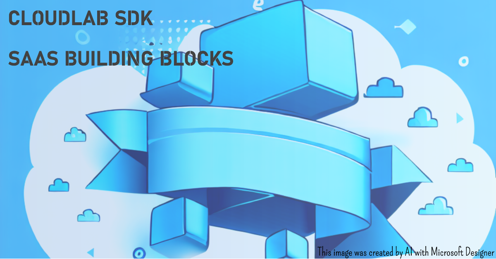

# The CloudLab Software Development Kit for SaaS (SDK)
This project refers to a SDK used to build SaaS and Micro-SaaS for cloud platforms, especially for Microsoft Azure, using dotnet, netcore and C#.

In this SDK you'll find implementations of architectural patterns, cloud concepts, tools and infrastructure details used to build any SaaS or Micro-SaaS solutions.

There are several packages in this project, each one with its own cloud tecnology context.

To learn more about this project, feel free to browse the following links of our wiki pages:

## The Project
- [Background and the Vision](https://github.com/cloudlabtech/SDK-SaaS/wiki/Background-and-the-Vision)
- [The SaaS Building Blocks](https://github.com/cloudlabtech/SDK-SaaS/wiki/The-SaaS-Building-Blocks)
- [Concepts](https://github.com/cloudlabtech/SDK-SaaS/wiki/Concepts)
- [Features](https://github.com/cloudlabtech/SDK-SaaS/wiki/Features)
- [Packages](https://github.com/cloudlabtech/SDK-SaaS/wiki/Packages)
- [Roadmap](https://github.com/cloudlabtech/SDK-SaaS/wiki/Roadmap)
- [Releases](https://github.com/cloudlabtech/SDK-SaaS/wiki/Releases)
- [Release Notes](https://github.com/cloudlabtech/SDK-SaaS/wiki/Release-Notes)

## Package Versions
| Package Name | Version | Description |
| ------------ | ------- | ----------- |
| CloudLab.SDK.SaaS |  | SaaS SDK |
| CloudLab.SDK.MongoDB |  | MongoDB SDK |

## Contributing
If you want to contribute with this project, please refer to:
- [Commit Convention Guidelines](https://github.com/cloudlabtech/SDK-SaaS/wiki/Commit-Convention).
- [Contribution Guidelines](https://github.com/cloudlabtech/SDK-SaaS/blob/main/CONTRIBUTING.md)
- [Contribution to Wiki Pages Guidelines](https://github.com/cloudlabtech/SDK-SaaS/wiki/How-to-Contribute-to-Wiki)

Thanks to the following contributors who have helped with the project:
- Eric Roberto Darruiz - [@edarruiz](https://github.com/edarruiz)

## Documentation
All documentation for this project can be found in the [SDK Documentation](https://github.com/cloudlabtech/SDK-SaaS/wiki/SDK-Documentation) wiki page.

Also in the wiki, you can find:
- [Quickstart](https://github.com/cloudlabtech/SDK-SaaS/wiki/Quickstart)
- [Examples](https://github.com/cloudlabtech/SDK-SaaS/wiki/Examples)

## License
This project is licensed under the [MIT License](https://github.com/cloudlabtech/SDK-SaaS/blob/main/LICENSE).